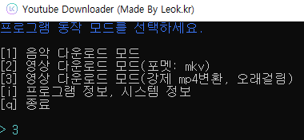
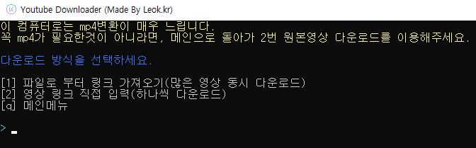
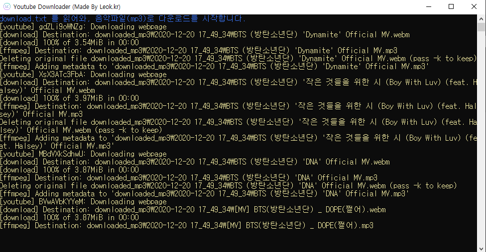
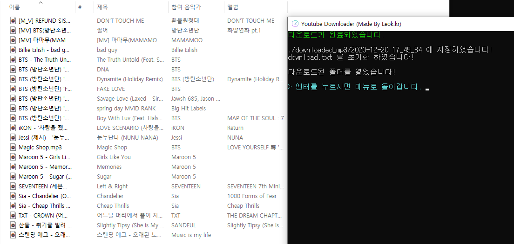
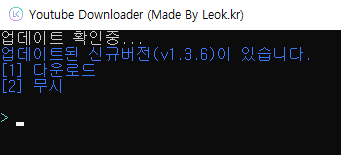

# 🛠️Enchanted Youtube Downloader
Youtube-dl 을 활용해 만든 간단하지만 유용한 유튜브 다운로더 입니다.<br>
**아직 완성된 버전이 아니며, 곧 GUI 버전도 나올 예정입니다.**

## 📥다운로드
[Github: 최신 릴리즈](https://github.com/331leo/enchanted_ytdl/releases/latest) <br>
[Direct Download: Windows Exe](https://leok.kr/eytdl)

## 📋기능
링크를 파일에 담아 일괄 다운로드 할수 있으며, 한 영상씩도 다운 가능합니다.

현재 다운로드 옵션은 3가지 입니다.<br>

[1] 음악 다운로드 모드<br>
[2] 영상 다운로드 모드(포멧: mkv)<br>
[3] 영상 다운로드 모드(강제 mp4변환, 오래걸림)<br>

## 📌사용전 안내사항
이 프로그램의 일부 기능은 컴퓨터 성능이 처리 속도, 인터넷 속도에 많은 영향을 받습니다.<br>
`mp4로 변환해 다운로드`의 경우 NVIDIA 그래픽 카드을 사용할 경우에만 하드웨어 가속이 적용되며, <br>
그 이외의 GPU 이용시 속도가 굉장히 느립니다.

## 📷작동 스크린샷





## 	🔄자동 업데이트
해당 프로그램은 자동 업데이터 기능이 포함되어 있으며, 
최신버전의 빌드가 나올경우, 사용자에게 업데이트 여부를 물어봅니다.



## 🤖직접 빌드하기
배포된 파일의 경우 현재 Windows만 지원하며, <br>
macOs, Linux의 경우 직접 빌드후, FFMPEG를 별도로 설치하셔야 기능이 작동됩니다.

이 프로그램을 직접 빌드하려면 <br>
이 저장소를 클론하신후 `build.cmd`를 실행하거나, 
다음 명령어를 입력하십시오.
```shell
python -m pip installl -r requirements.txt
pyinstaller --onefile --icon=icon.ico --name=Enchanted_ytdl-{버전} main.py
```


